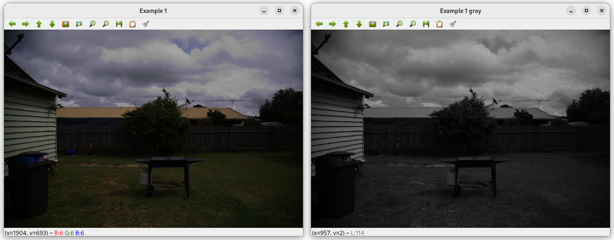

# Report on Lab 02

## Task 1
The program take 2 input: the RGB image path and the output gray-scale image path.
```shell
./task1/build/main image.jpg image_gray.jpg
```
This task was very easy. The program created convert a color image into a gray-scale image using `cv::cvtColor()` function provided by OpenCV.
This is the result:



## Task 2
The program take 1 input: the RGB image path.
```shell
./task2/build/main image_gray.jpg
```
Even if the input is a color image the processing is done on the its gray-scale version. To do the conversion there are 2 options:

- using `cv::cvtColor()` function (like in the first task)
- using `cv::IMREAD_GRAYSCALE` flag when the function `cv::imread()` is called