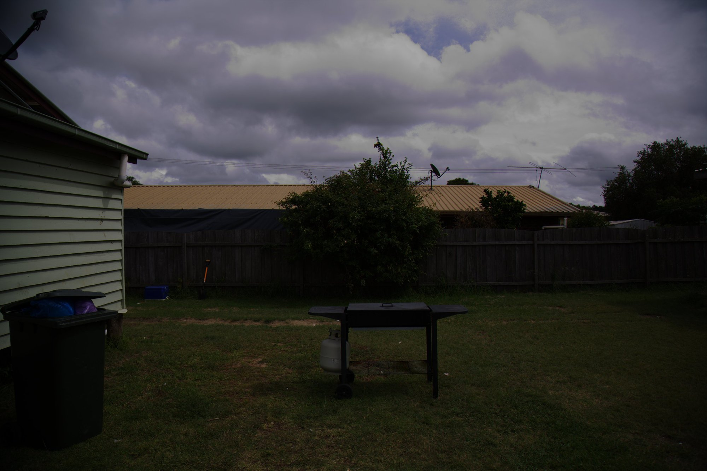
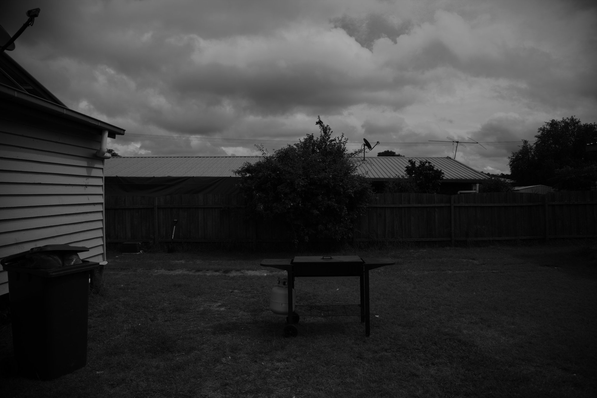

# Report on Lab 02

## Task 1
The program take 2 input: the RBG image path and the output grayscale image path.
```shell
./task1/build/main image.jpg image_gray.jpg
```
This task was very easy. The program created convert a color image into a grayscale image using `cv::cvtColor()` function provided by OpenCV.
This is the result:

<div style="display: flex">
  
  
</div>