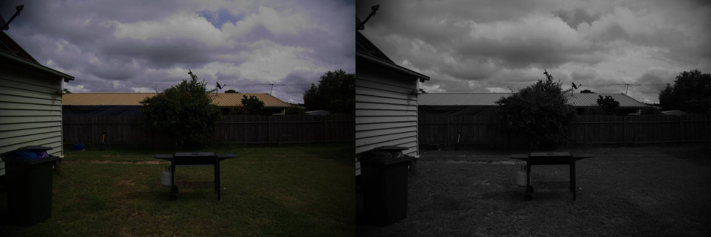
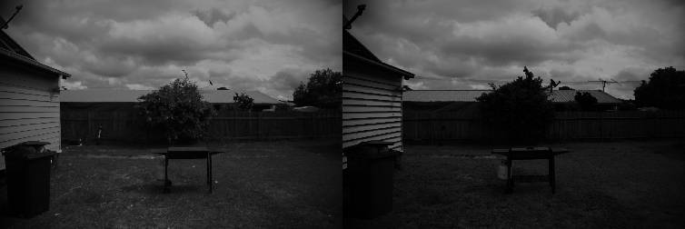
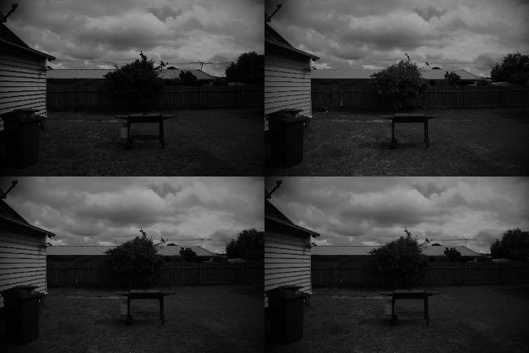
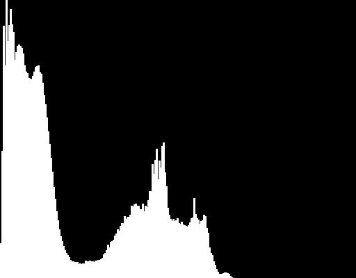
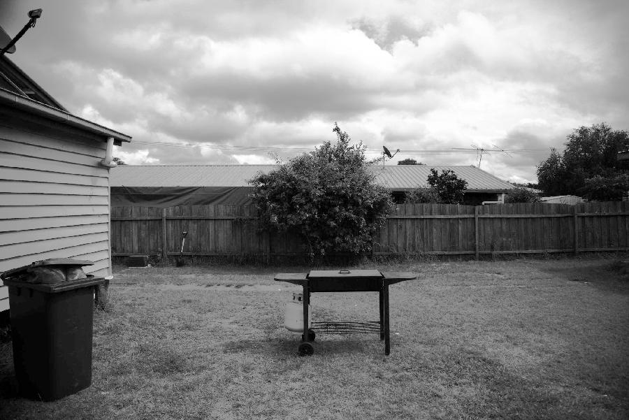
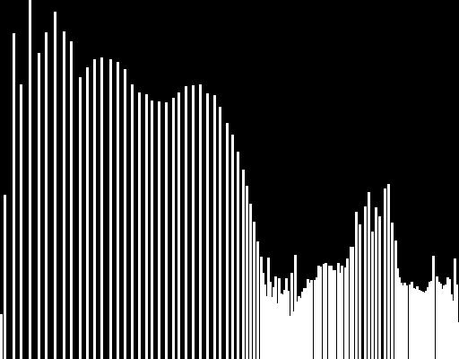

# Report on Lab 02

## Task 1
The program take 2 input: the RGB image path and the output gray-scale image path.
```shell
./task1/build/main image.jpg image_gray.jpg
```
This task was very easy. The program created convert a color image into a gray-scale image using `cv::cvtColor()` function provided by OpenCV.

This is the result (the left image is the original, the right image is the gray-scale conversion):


## Task 2
The program take 1 input: the gray-scale image path.
```shell
./task2/build/main image_gray.jpg
```
Using `cv::IMREAD_GRAYSCALE` flag when the function `cv::imread()` is called, OpenCV read the image as a gray-scale one, without this flag OpenCV read the image as a colored one.

The two min and max filter function are very similar. There are 2 `for` loop in order to access every pixel using the `.at<>()` method.
```c++
for (int i = 0; i < dst.rows; i++) {
  for (int j = 0; j < dst.cols; j++) {
```
With 2 additional `for` loop the functions access the neighboors and compute the minimum and maximum respectively.
```c++
for (int k = -kernel_size / 2; k < kernel_size / 2 + 1; k++) {
  for (int w = -kernel_size / 2; w < kernel_size / 2 + 1; w++) {
```
In order to not get a segmentation fault when accessing out-of-bounds pixels, the index is check before using `.at<>()` method.
```c++
if ((i + k > 0) && (i + k < dst.rows) && (j + w > 0) && (j + k < dst.cols)) {
  u_char curr = src.at<u_char>(i + k, j + w);
```

The best result for removing the electric cable is using the max filter (in the left) and a kernel size of 5. The min filter (in the right) enhance the cable.


## Task 3
The program take 1 input: the gray-scale image path.
```shell
./task3/build/main image_gray.jpg
```

This task was very easy. The program create 4 images using 4 different filter: min, max, median (using `cv::medianBlur()`) and gaussian (using `cv::GaussianBlur()`).

The results (top left: min filter; top right: max filter; bottom left: median filter; bottom right: gaussian filter):


# Task 4
The program take 1 input: the gray-scale image path.
```shell
./task4/build/main image_gray.jpg
```

The program created generate an histogram using the function `cv::calcHist()` provided by OpenCV. The function is not very intuitive and there is needed some post-processing to obtain an actual histogram: using `cv::normalize()` in order to obtain result from 0 and the height of the histogram image. Then using `cv::rectangle()` for generating the bars of the histogram.

This is the result with 256 bins:


# Task 5
The program take 1 input: the gray-scale image path.
```shell
./task5/build/main image_gray.jpg
```

The program created generate an equalized version of the image in the input using `cv::equalizeHist()`:


It also generate a histogram of the equalized image:

